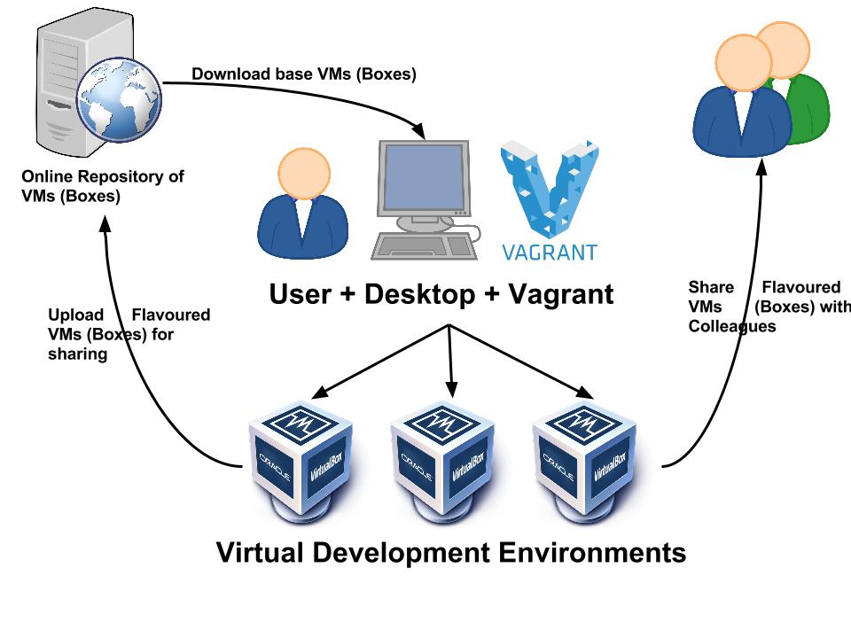

# Multi-machine Environment 
Vagrant is able to define and control multiple guest machines per Vagrantfile. This is known as a "multi-machine" environment.



## How to create multi-machine environment

Multiple machines are defined within the same project Vagrantfile using the `config.vm.define` method call.

**Vagrantfile:**
```
Vagrant.configure("2") do |config|
  
    
  config.vm.define "app" do |app|

    # This configures what box the machine will be brought up against
    app.vm.box = "ubuntu/xenial64"
    # Configures networks on the machine to specify a static IP address for the machine
    app.vm.network "private_network", ip:"192.168.10.100"
    #  Configures synced folders on the machine, so that folders on your host machine can be synced to and from the guest machine. 
    app.synced_folder ".", "/home/vagrant/environment"
    # Vagrant will upload the provision script and execute it
    app.vm.provision "shell", path:"environment/provision.sh"

  end 
  
  config.vm.define "db" do |db|

    db.vm.box = "ubuntu/xenial64"
    db.vm.network = "private_network", ip:"192.168.10.50"
    db.vm.provision "shell", path:"environment/dbprovision.sh"
  end

end

```
This variable, such as app above, is the exact same as the config variable, except any configuration of the inner variable applies only to the machine being defined. Therefore, any configuration on app will only affect the app machine.


## Provisions for 'db' VM

We must install mongodb to be able to connect to the database 

**dbprovision.sh:**
```
# Add the MongoDB GPG key to your system
sudo apt-key adv --keyserver hkp://keyserver.ubuntu.com:80 --recv D68FA50FEA312927

# Once the key is imported, add the MongoDB repository with:
echo "deb https://repo.mongodb.org/apt/ubuntu xenial/mongodb-org/3.2 multiverse" | sudo tee /etc/apt/sources.list.d/mongodb-org-3.2.list

# Refresh the local database with the packages
sudo apt-get update -y
sudo apt-get upgrade -y

# Install the last stable mongodb version and all the necessary packages
sudo apt-get install mongodb-org -y

#try to install individual packages if the above doesnt work:
sudo apt-get install -y mongodb-org=3.2.20 mongodb-org-server=3.2.20 mongodb-org-shell=3.2.20 mongodb-org-mongos=3.2.20 mongodb-org-tools=3.2.20

sudo rm /etc/mongod.conf
sudo ln -s /home/vagrant/environment/mongod.conf /etc/mongod.conf

sudo systemctl restart mongodb
sudo systemctl enable mongod
```

# Connecting to 'db' VM

- `vagrant ssh db`

- Edit the `mongod.conf` file to change the bindIP => 0.0.0.0: `sudo nano /etc/mongod.conf`

```
net:
  port: 27017
  #bindIp: 127.0.0.1 => 0.0.0.0 being the alias for "listen on all available network interfaces
  bindIp: 0.0.0.0
```


## Provisions for 'app' VM

To allow th app to run we will need:
- nginx: Open source software for web serving
- nodejs: JavaScript runtime environment needed to execute a program written in JavaScript.
- npm: A command-line utility for interacting with an online repository, for the publishing of open-source Node.js projects, that aids in package installation, version management, and dependency management.

**provision.sh:**
```
!#/bin/bash

sudo apt-get update -y

sudo apt-get upgrade -y

sudo apt-get install nginx -y

sudo apt-get install nodejs -y

sudo apt-get install python-software-properties -y

curl -sL https://deb.nodesource.com/setup_6.x | sudo -E bash -

sudo npm install pm2 -g -y

npm install -y

npm start

```
## Creating a Presistent varibale 

- Now we must create a presistent variable `DB_HOST` to connect to mongodb with a given ip that connects to the post. 

- `sudo nano /etc/environment` and input your variable.

```
DB_HOST="mongodb://192.168.10.150:27017/posts"
```

- Restart VM 

- To check if it worked: `printenv DB_HOST` and it should return `"mongodb://192.168.10.150:27017/posts"`

## Run the app
- When in the app directory run `sudo node seeds/seed.js`

- Now for the fun part , run `npm start` then check `http://192.168.10.100:3000/posts`


# Let's Automate this Task Now.


